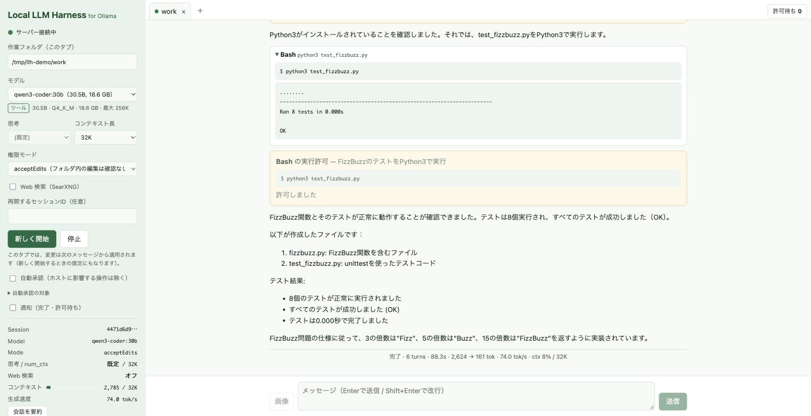
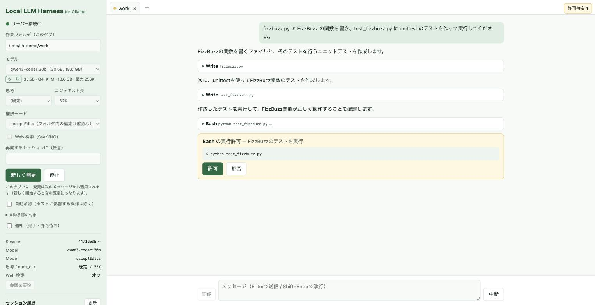

# Local LLM Harness

[English](README.md) | 日本語

[](https://github.com/moooyooo/local-llm-harness/actions/workflows/ci.yml)

**Ollama のローカル LLM** をコーディングエージェントとして動かす、ローカル専用の Web GUI ハーネスです。
操作感は、作者が作った Claude Code 用の Web GUI ハーネス（非公開）にそろえています。

Claude Code CLI の代わりに、サーバー内の自前のエージェントループが Ollama の `/api/chat`（ツール呼び出し）を使い、
ファイルの読み書きやコマンド実行を行います。通信はこの PC の中で完結します（Web 検索を ON にしたときを除く）。

- 動作確認: macOS（Apple シリコン）、Ollama 0.32・0.34。Windows（シェルは PowerShell）でも動くように作っていますが、未確認です
- **画面の言語は日本語・英語・中国語（簡体字）です。** 最初はブラウザの言語（変えていなければ OS の言語）で表示し、
  そのどれでもなければ英語で表示します。左パネルの「表示言語」で切り替えられます。
  カタログを足せば別の言語にも対応できます（[言語の追加](#言語の追加)）



## 必要なもの

- Node.js 22 以上（`fs.glob` を使うため）
- [Ollama](https://ollama.com) が起動していること（既定: `http://127.0.0.1:11434`）
- ツール呼び出しに対応したモデル（例: `qwen3-coder:30b`, `qwen3.6:35b-a3b`, `gemma4` など）
- あると速いもの: [ripgrep](https://github.com/BurntSushi/ripgrep)（`rg`。なければ Grep は JavaScript 実装で動きます）
- Web 検索を使う場合: Docker（[OrbStack](https://orbstack.dev) など）。検索はローカルで動かす [SearXNG](https://github.com/searxng/searxng) を使います

## 使い方

```sh
git clone https://github.com/moooyooo/local-llm-harness.git
cd local-llm-harness
npm install
npm run dev        # 開発: http://localhost:38722
# または
npm run build
npm start          # 本番: http://localhost:38720
```

1. 左のパネルで作業フォルダ・モデル・思考・コンテキスト長・権限モードを選ぶ
2. 「開始」を押し、メッセージを送る
3. ファイル編集やコマンド実行の前に、画面に「許可 / 拒否」が表示される（Edit は差分で表示）



### Web 検索の準備（使う場合だけ）

```sh
brew install --cask orbstack   # Docker 環境（初回は OrbStack を起動して初期設定する）
npm run searxng                # SearXNG を起動（初回は設定ファイルとコンテナを作る。127.0.0.1:38730 だけで待ち受け）
npm run searxng -- stop        # 停止（status で状態確認）
```

左パネルの「Web 検索（SearXNG）」を ON にすると、そのタブのモデルが WebSearch / WebFetch を使えるようになります（既定は OFF）。

### 常に使えるようにする（ログイン時に本番を自動起動、Mac）

| | コマンド |
| --- | --- |
| 自動起動を登録（その場で起動もする） | `scripts/mac/autostart.sh install` |
| ハーネスを変更したあとに再起動（ビルドし直す） | `scripts/mac/autostart.sh restart` |
| 状態を見る | `scripts/mac/autostart.sh status` |
| 登録を解除（本番も停止） | `scripts/mac/autostart.sh uninstall` |
| 起動してブラウザで開く | `scripts/mac/start-harness.sh` |

- LaunchAgent（`~/Library/LaunchAgents/com.moooyooo.custom-harnes-local-llm.plist`）で、ログイン時に http://localhost:38720 を起動し、落ちても自動で再起動します。
  初回は macOS から「バックグラウンド項目が追加されました」と通知されます。「システム設定 > 一般 > ログイン項目」でオフにすると起動しません。
- エージェントが git・npm・docker などを使えるよう、`install` を実行したターミナルの PATH・SHELL・LANG を引き継ぎます。
  コマンドを新しく入れたとき、フォルダを移動したとき、node を入れ直したときは `install` をやり直してください。
- 本番は起動のたびにビルドし直し、`dist-prod/` から配信します。開発中に `npm run build` しても本番の画面は変わりません。
- ログは `logs/harness.log` に出ます。登録中は `npm start` を使わないでください（同じポートを取り合います）。
- Windows 用の自動起動はまだありません。

## 機能

基本機能:

- 応答のストリーミング表示（Markdown 対応）。思考（reasoning）もリアルタイムに表示し、完了後は折りたたむ
- ツール呼び出しと結果の折りたたみ表示
- GUI 上での実行許可ダイアログ
- 中断、停止、セッション ID を指定した再開
- 複数セッションをタブで並行して操作する（各タブにフォルダ名と状態を表示）。全タブの許可待ちを「受信箱」でまとめて処理する
- 自動承認（左パネルで ON にする）：ホストに影響しない操作の確認を自動で「許可」する。
  作業フォルダ外への書き込み・削除・git push・グローバルインストール・管理者権限・プロセスの操作などは、手動確認のまま
  （判定ルールは `server/autoApprove.ts`）
- git init/add/commit/push の直前にセキュリティチェックを行う（自動承認の ON/OFF、権限モードに関係なく実行）。
  API キー・トークン・秘密鍵・パスワード付きの接続文字列・.env・証明書・.gitignore すべきフォルダ・大きなファイルを検出し、
  見つかった場合は自動承認せず、許可ダイアログに一覧を表示する
- 完了・許可待ちのブラウザ通知（ページが裏にあるとき、または別タブのときだけ通知する）
- 初期画面で「最近の作業フォルダ」を選び、そのフォルダで新しく開始するか、過去のセッションを再開する
- セッション履歴の一覧（日時・モデル・件数）。クリックで再開し、過去の会話も表示する

ローカル LLM 向けの機能:

- **日本語・英語・中国語（簡体字）の画面**：ブラウザの言語に合わせて選び（どれでもなければ英語）、左パネルで切り替えられる。
  保存した履歴も選んだ言語で表示する

- **モデル選択**：インストール済みのモデルを一覧表示し、ツール / 思考 / 画像の対応、サイズ、最大コンテキスト長を表示する
- **思考の切り替え**（既定 / オン / オフ / low・medium・high）と**コンテキスト長**（`num_ctx`）の指定
- **コンテキスト使用率のメーターと生成速度（tok/s）**
- **Ollama の接続状態とメモリ上のモデル**の表示
- 権限モード: `default` / `acceptEdits` / `plan`（読み取りのみ・計画を立てる）/ `bypassPermissions`
- 作業フォルダの `AGENTS.md` / `CLAUDE.md` をプロジェクトの指示としてシステムプロンプトに読み込む
- ローカルモデルにありがちな失敗への対策: 同じツール呼び出しの繰り返しを止める、Read せずに Edit・上書きしない、
  失敗が確定している呼び出しでは許可を求めない、ツール出力を上限で切り詰める
- 長い作業を途中で止めないための対策:
  - 大きなファイルは約 200 行ずつ分けて書くよう指示する
  - 1 回の出力を 16,384 トークンまでに制限し、超えたら「小さく分けて」と自動で 1 回だけ再依頼する
  - ツール呼び出しを生成している間（Ollama は何も送ってこない）も通信を切らず、最後の出力からの経過時間を表示する
  - エラー・中断・上限で止まったときは「続きから再開」ボタンで、作業フォルダを確認させてから続けさせる
  - ページを閉じたり再読み込みしたりしてもセッションは止まらず、作業を続ける。ページを開き直すとタブに再び表示される
    （開いていたタブはブラウザに記憶する）。どのページにも表示されていないセッションは、作業していない状態が 30 分続くと止める
- **画像入力**（vision 対応モデル）：スクリーンショットなどをクリップボードから貼り付け、ドラッグ＆ドロップ、または「画像」ボタンで添付する。
  長い辺が 1600px を超える画像は縮小して送る（1 枚でおよそ 1,500 トークン）。画像非対応のモデルに切り替えても、過去の画像は注記に置き換えて会話を続けられる
- **実行中の設定変更**：開始済みのタブでは、左パネルのモデル・思考・コンテキスト長・権限モード・Web 検索を変えると次のメッセージから適用される（応答中は変更不可）
- **コンテキストの圧縮**：コンテキストの 80% に近づくと、古いやり取りをモデルに要約させて置き換える
  （Ollama は上限を超えると古い内容を黙って捨てるため）。直近のやり取りと最新の依頼の原文は残す。
  左パネルの「会話を要約」でいつでも実行でき、要約の内容は会話の中で開いて確認できる
- **Web 検索**（ON/OFF、既定 OFF）：ローカルの SearXNG で検索し、Web ページを本文だけのテキストにして読む。
  ページの取得はこの PC や LAN には届かず、検索語や URL に秘密情報らしいものがあれば送らない
- **チェックポイント**：メッセージを送るたびに（長いターンではファイルを変えるツールを 10 回使うごとにも）作業フォルダのファイルを記録する。
  会話の中のチェックポイントから、その時点のあとの変更をファイルごとに差分で確認でき、「ここに戻す」で確認のうえファイルを戻せる。
  戻す直前の状態も記録するので戻したこと自体も取り消せ、戻したことはモデルにも伝える。記録はハーネス専用の Git リポジトリ
  （データフォルダの `checkpoints/`）に置き、作業フォルダの `.git` には触れない（Git 管理していないフォルダでも使える）。
  `.gitignore` の対象・依存フォルダ・フォルダ内の Git リポジトリ・20 MB を超えるファイルは対象外。フォルダの外への変更（インストールや push）は戻せない。`git` が必要

### エージェントが使えるツール

| ツール | 内容 | 確認（default モード） |
| --- | --- | --- |
| Read / Glob / Grep / LS | 読み取り・検索 | 作業フォルダ内は確認なし（外や認証情報は確認） |
| Write / Edit | ファイルの作成・上書き・部分置換 | 確認あり（`acceptEdits` ではフォルダ内は確認なし） |
| Bash（Windows では PowerShell） | コマンド実行（既定 2 分でタイムアウト） | 確認あり |
| WebSearch / WebFetch（Web 検索が ON のときだけ） | SearXNG での検索・Web ページの取得（この PC と LAN には届かない） | 確認あり（自動承認の対象） |

## 環境変数

| 変数 | 既定値 | 説明 |
| --- | --- | --- |
| `PORT` | 本番 `38720` / 開発 `38721` | サーバーのポート（既定値は `shared/ports.ts`） |
| `HARNESS_CWD` | サーバー起動時のフォルダ | 作業フォルダの既定値 |
| `OLLAMA_HOST` | `http://127.0.0.1:11434` | Ollama の URL |
| `HARNESS_DATA_DIR` | `~/.custom-harnes-local` | セッション履歴（`sessions/<id>.jsonl`）、チェックポイント（`checkpoints/`。30 日使われないものは削除）、SearXNG の設定（`searxng/`）の保存先 |
| `SEARXNG_URL` | `http://127.0.0.1:38730` | WebSearch が使う SearXNG の URL |
| `HARNESS_FEATURES` | なし | オンにする実験的な切り替え（カンマ区切り、または `all`。下記） |

### 実験的な切り替え

ローカルモデルに長い作業をやり切らせるための変更です。効果が測定（`scripts/eval`）で確かめられるまで、既定ではオフにしています。
`HARNESS_FEATURES` でオンにします（例: `HARNESS_FEATURES=fuzzyEdit,todoList npm start`）。

| 名前 | 内容 |
| --- | --- |
| `fuzzyEdit` | Edit の `old_string` がファイルと空白やインデントだけ違う場合、一致する箇所が 1 か所だけなら置換する。どこにも一致しなければ、いちばん似た行を示す |
| `failureAdvice` | ツールの失敗が続いたときや、同じファイルの Edit が何度も失敗したときに、考え直すよう結果に添える |
| `loopDetection` | 同じ内容を繰り返し出力し始めたら止めて、1 回だけ再依頼する |
| `outputLimit` | 1 回の出力をコンテキストの残りまでに制限する（超えると Ollama は会話の先頭から黙って捨てるため）。思考ありのときは 65% で圧縮する |
| `trimOutputs` | 要約の前に、古いツール出力を短い案内に置き換える |
| `todoList` | モデルに作業の手順をチェックリスト（TodoWrite。左パネルに表示）で管理させ、ツール 10 回ごとに見せ直し、未完了のまま終えようとしたら 1 回だけ促す |

## ヒント

- モデルの初回読み込みには数秒〜数十秒かかります。読み込み済みのモデルは左下の「メモリ上のモデル」に表示されます
- 長い作業では 32K 以上のコンテキスト長をおすすめします。モデルが指定より小さい窓で読み込まれていたら、ハーネスが解放して読み込み直します
  （MLX 系のモデルは、Ollama が自分では読み込み直さないため）。読み込み直しには数十秒かかります
- 思考をオフにすると速くなりますが、難しい作業の質は下がります
- MoE モデル（`qwen3-coder:30b`、`qwen3.6:35b-a3b` など）は速く、対話的な作業に向いています

## 注意

- 自分のマシン上で、自分だけが使う前提で作っています。ネットワークに公開しないでください
- エージェントは、この PC 上でファイルを書き換え、コマンドを実行します
- サーバーは `127.0.0.1` でのみ待ち受け、WebSocket は許可したオリジンからしか受け付けません
- ローカルモデルはクラウドの最上位モデルより間違えやすいです。`bypassPermissions` や自動承認は、内容を理解したうえで使ってください
- Web 検索を ON にすると、検索語と取得する URL が外部に送られます
- ページを閉じても実行中の作業は止まりません。止めるときは「停止」を押すか、タブを閉じて（×）ください

## 言語の追加

画面に出る文言は、すべて `shared/i18n/` にあります。`ja.ts`（日本語）・`en.ts`（英語）・`zh-CN.ts`（中国語 簡体字）です。
日本語が基準で、メッセージのキーを決めています。英語が既定で、対応していない言語のブラウザには英語を表示し、
新しい言語で訳していないキーも英語で補います。

1. `shared/i18n/en.ts` を `shared/i18n/fr.ts` などにコピーし、export 名を `fr` にして、値を訳します。
   `{名前}` の差し込みはすべて残してください。`{count|file|files}` は `count` が 1 なら前の形、それ以外なら後の形になります。
   数で語形が変わらない言語は `{count}` だけで構いません。訳し終わるまでは、型を `Record<MessageKey, string>` ではなく
   `Catalog` にしておきます。
2. `shared/i18n/index.ts` の `LOCALES` に、表示名と一緒に登録します（例: `fr: { name: 'Français', messages: fr }`）。
   ブラウザの言語がその言語ならそれが選ばれ、左パネルの「表示言語」にも出ます。
3. `npm test` を実行します。各カタログが既知のキーだけを使い、差し込みがそろっていること、対応する言語がすべてのキーを
   訳していることを確認します。カタログを通さずにコードへ直接書いた画面の文言があれば、テストが失敗します。

新しい文言は、先に `ja.ts` に足し、ほかのカタログにも足します（`en.ts`・`zh-CN.ts` に足すまで `npm run typecheck` が失敗します）。

サーバーは完成した文ではなく「キーと値」を送るので、保存した履歴も今の言語で表示されます。
動かす人向けの出力（サーバーのログ、`scripts/`）は、まだ翻訳の対象外です。

## ライセンス

[MIT](LICENSE)
